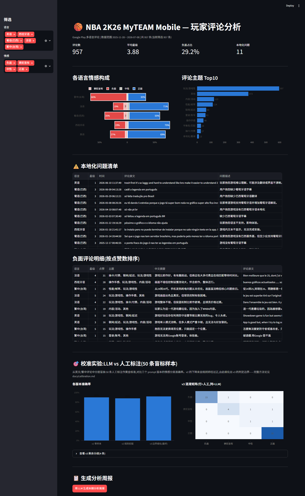

# 🏀 游戏玩家评论智能分析工具 — Game Review Analyzer

> **EN** — An end-to-end pipeline that scrapes multi-language Google Play reviews of
> *NBA 2K26 MyTEAM Mobile* (EN/ES/PT/FR/zh-TW, ~1,000 reviews), performs per-review LLM
> analysis (sentiment, topic tagging, localization-issue detection, Chinese summarization),
> and serves the results in an interactive Streamlit dashboard. Classification quality is
> validated through a **blind human-labeled calibration experiment**: accuracy improved from
> 90% (zero-shot) to 92% via prompt iteration — including an honestly documented
> regression to 88% caused by over-corrected rules, which is where the real methodology lives.

抓取 Google Play 上《NBA 2K26 MyTEAM Mobile》的**五语言玩家评论**(英/西/葡/法/繁中,约千条),
用 LLM 逐条完成**情感分类、主题打标、本地化问题识别、中文摘要**,以 Streamlit 交互式面板呈现,
并通过**人工盲标校准实验**验证分类质量(准确率 90% → 92%)。



## ✨ 这个项目想展示什么

1. **对齐真实发行业务**:多语言舆情监控 + 本地化质量追踪,是游戏国际化发行的日常需求
2. **LLM 输出不是拿来就信的**:用人工标注校准 + prompt 迭代给出可信度证据,
   并如实记录了一次"规则矫枉过正导致准确率下降"的失败迭代(v2)
3. **工程化的分析管线**:断点续跑、结构化 JSON 输出、字段校验兜底,957 条评论
   全程零失败,API 总成本约 ¥3

## 📊 核心发现(示例)

| 发现 | 数据支撑 |
|------|----------|
| **繁中区口碑倒挂**:负面率 66%,接近英西法区(19~27%)的三倍 | 抱怨集中在性能/帧率(安卓锁 30 帧)、联网延迟 |
| **巴西市场本地化缺口**:葡语区负面率 35% 居第二 | 玩家反复留言"缺少葡语字幕/翻译"("só falta tradução pro Brasil") |
| 整体主题榜:玩法/游戏性 > 内容/活动 > 性能/帧率 > 联网/延迟 | 面板主题 Top10 可按语言/情感钻取 |

## 🎯 校准实验(准确率是怎么来的)

从英文/繁中评论中**分层盲抽 50 条人工标注**作黄金标准(标注时不展示 LLM 结果),
对比三个 prompt 版本:

| 版本 | 准确率 | 说明 |
|------|--------|------|
| v1 零样本 | 90% | 仅任务描述,讽刺识别已表现良好 |
| v2 规则初版 | 88% ⬇ | 错误驱动的规则**矫枉过正**:把"许愿新增内容"误当抱怨、把褒义短评吞进中性 |
| v3 边界细化 | **92%** ✅ | 区分"现存问题 vs 许愿"、"信息量不足按星级折算"等 5 条口径 |

方法论要点:few-shot 示例全部**仿写**(不用校准集原句,避免评测泄漏);
剩余 4 条分歧均为边界案例,**止步 v3** 避免对校准集过拟合。
详见 [docs/calibration.md](docs/calibration.md) 与 [docs/prompt_history.md](docs/prompt_history.md),
逐条对比数据在 `data/calibration_results.csv`(运行后生成)。

## 🚀 快速开始

```bash
git clone https://github.com/kobe8244/game-review-analyzer.git
cd game-review-analyzer
python -m venv venv

# Windows                          # macOS / Linux
venv\Scripts\pip install -r requirements.txt     # venv/bin/pip install -r requirements.txt
copy .env.example .env                            # cp .env.example .env
# 编辑 .env,填入 DEEPSEEK_API_KEY(https://platform.deepseek.com)

venv\Scripts\python src\scraper.py    # 1. 抓取评论 -> data/reviews_raw.csv
venv\Scripts\python src\analyzer.py   # 2. LLM 逐条分析 -> data/reviews_analyzed.csv(断点续跑)
venv\Scripts\streamlit run app.py     # 3. 打开面板 http://localhost:8501
```

> 抓取 Google Play 需要相应的网络环境;分析 1,000 条评论约需 50 分钟、成本约 ¥2(deepseek-chat)。

## 📁 项目结构

```
├── src/
│   ├── scraper.py    # 五语言区评论抓取、去重 -> CSV
│   ├── prompts.py    # 所有 prompt 集中管理(v1→v3 演进史在文件头)
│   └── analyzer.py   # 逐条 LLM 分析:断点续跑、JSON 校验、成本统计
├── app.py            # Streamlit 面板(KPI/发散情感图/主题榜/本地化清单/校准实验/LLM 周报)
├── docs/
│   ├── calibration.md     # 校准实验完整报告
│   └── prompt_history.md  # 三版 prompt 规则原文对比
└── data/             # 原始与分析后 CSV(不入库)
```

## 🛠 技术栈

Python · google-play-scraper · pandas · DeepSeek API(openai SDK,temperature=0 + JSON mode)
· Streamlit · Plotly

## ⚠️ 局限与后续方向

- 校准样本 n=50、单标注者、仅覆盖英文/繁中;es/pt/fr 的准确率未经人工验证
- 更严谨的做法是保留 held-out 集验证最终版本;主题打标与本地化识别尚未做人工校准
- 可扩展:定时增量抓取、竞品对比、负面评论自动预警
